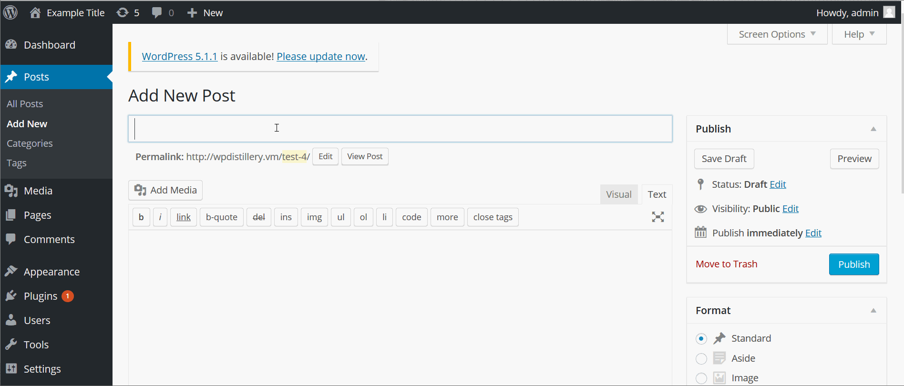
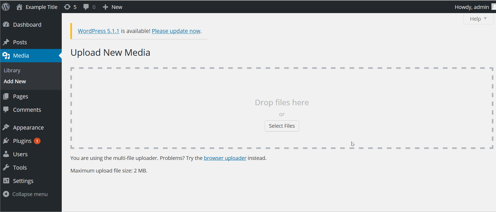
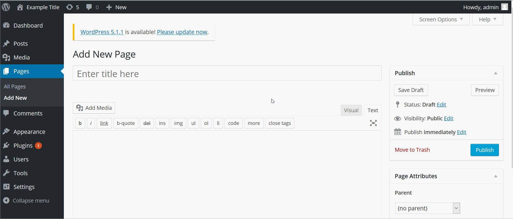
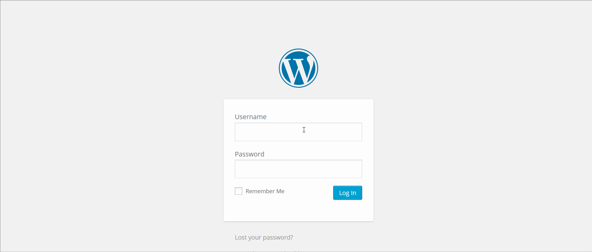

# Project 7 - WordPress Pentesting

Time spent: **12** hours spent in total

> Objective: Find, analyze, recreate, and document **five vulnerabilities** affecting an old version of WordPress

## Pentesting Report

1. (Required) WordPress <= 4.3 - Authenticated Shortcode Tags Cross-Site Scripting (XSS)
  - [x] Summary: An Cross Site Scripting (XSS) vulnerability that allows malicious script tags to be put in the HTML body and be executed. This can be done by abusing the way unclosed HTML elements during the processing of shortcode tags are mishandled. In this example, when user hovers over the infected HTML, an alert window appears.
    - Vulnerability types: XSS
    - Tested in version: 4.2
    - Fixed in version: 4.3
  - [x] GIF Walkthrough: 
  
    
  
  - [x] Steps to recreate: Create a post and enter the following script in the content: 
  
  ```
    [caption width="3" caption='<a href="' ">]</a><a href="http://onmouseover='alert(1)'"<XSS!</a>
  
  ```
  When user hovers over the text, the injected code will execute.
  - [x] Affected source code:  https://core.trac.wordpress.org/browser/branches/4.1/src/wp-includes/media.php
2. (Required) WordPress 2.5-4.6 - Authenticated Stored Cross-Site Scripting via Image Filename
  - [x] Summary: This vulnerability allows attackers to upload an image with an infected filename. This abuses the insufficient validation of the file names of uploaded images. 
    - Vulnerability types: XSS
    - Tested in version: 4.2
    - Fixed in version: 4.6
  - [x] GIF Walkthrough: 
  
    
  
  - [x] Steps to recreate: Create a new media post and upload an image with the following filename format:
  
    ```
    filename.png
    ```
    The injected code is executed when the attachment page is viewed.
  - [x] Affected source code:  https://core.trac.wordpress.org/browser/branches/4.2/src/wp-includes/media.php
3. (Required) WordPress 4.0-4.7.2 - Authenticated Stored Cross-Site Scripting (XSS) in YouTube URL Embeds
  - [x] Summary: This vulnerablity allows remote attackers to inject arbitrary web script or HTML via video URL in YouTube emebeds. In this example, infected code executes when the page is rendered.
    - Vulnerability types: XSS
    - Tested in version: 4.2
    - Fixed in version: 4.7.3
  - [x] GIF Walkthrough: 
  
    
  
  - [x] Steps to recreate: Create a new page and input the following code in the content:
    
    ```
    [embed src='https://youtube.com/embed/12345\x3csvg onload=alert(1)\x3e'][/embed]
    ```
  - [x] Affected source code:  https://core.trac.wordpress.org/browser/branches/4.1/src/wp-includes/media.php
4. (Optional) WordPress 4.2 - User Enumeration
  - [x] Summary: This exploit allows an attacker to enumerate through a list of usernames. Since the design allows a user to know if the username is invalid or not, an attacker can brute force user combinations.
    - Vulnerability types: SQL Injection (User authentication)
    - Tested in version: 4.2
    - Fixed in version:
  - [x] GIF Walkthrough: 
  
    
  
  - [x] Steps to recreate: Type in usernames in the username field and through the validation error use sql injection to brute force username combinations
  - [ ] Affected source code:
    - [Link 1](https://core.trac.wordpress.org/browser/tags/version/src/source_file.php)

## Assets

Three gifs are added in the folder

## Resources

- [WordPress Source Browser](https://core.trac.wordpress.org/browser/)
- [WordPress Developer Reference](https://developer.wordpress.org/reference/)

GIFs created with [LiceCap](http://www.cockos.com/licecap/).

## Notes


## License

    Copyright [2019] [Asif Rashid]

    Licensed under the Apache License, Version 2.0 (the "License");
    you may not use this file except in compliance with the License.
    You may obtain a copy of the License at

        http://www.apache.org/licenses/LICENSE-2.0

    Unless required by applicable law or agreed to in writing, software
    distributed under the License is distributed on an "AS IS" BASIS,
    WITHOUT WARRANTIES OR CONDITIONS OF ANY KIND, either express or implied.
    See the License for the specific language governing permissions and
    limitations under the License.

